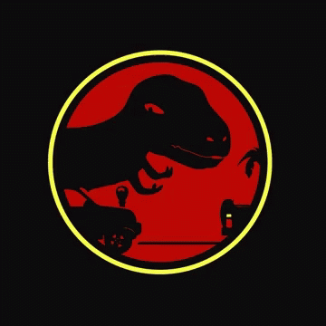

# Automonisaur: Core Libraries

**[build](#build)** | **[unittest in docker](#unittest-in-docker')** | 
**[unittest locally](#unittest-locally)** 

[](https://codecov.io/gh/TheShellLand/automon-core)

This library hasn't been added to pypi yet

#### build
```shell script
./biuld.sh
```

#### unittest in docker
```shell script
./test.sh
```

#### unittest locally
```shell script
./unittests.sh
```
